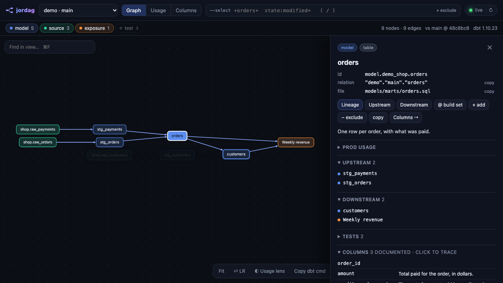
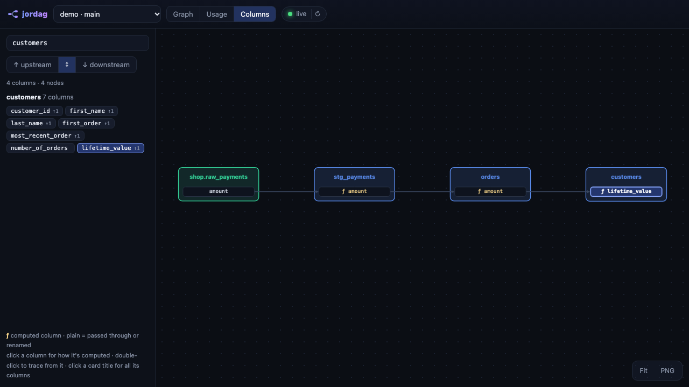

# jordag

**A live, local dbt DAG viewer, built for working across many git worktrees at once.**

Run `jordag` inside any dbt project and a browser tab opens on its DAG. Every other worktree of the repo is one dropdown away.
- **Live:** edit a model and the graph updates about two seconds later.
- **Query:** type any dbt selector (`+orders+`, `tag:finance`, `state:modified+`) and it redraws instantly.
- **Two deeper views:**
  - **Usage**, for Snowflake: who actually reads each model in production.
  - **Columns**, for any warehouse: column-level lineage for one column at a time.



## Quick start

You need:
- **Python 3.9+** and **git**.
- **dbt** installed in your project's `.venv` or `venv`, or on your `PATH`.
- **Node 18+**, only for `jordag query` and the agent skills.

```bash
git clone https://github.com/jordanmoritz/jordag.git
cd jordag
python3 jordag.py setup        # links the `jordag` command into ~/.local/bin and the agent skills into ~/.claude/skills
```

Then, from inside any dbt project or worktree:

```bash
jordag
```

That starts a background server at `http://127.0.0.1:8765` (set `JORDAG_PORT` to change it) and opens your browser. One server handles every project. Projects you open are remembered, and each one brings along all of its git worktrees.

### Try it on the demo first

The repo includes a tiny DuckDB project, so there's no warehouse to set up:

```bash
python3 -m venv demo/.venv && demo/.venv/bin/pip install dbt-duckdb sqlglot
cd demo && jordag      # or `python3 ../jordag.py` if this checkout is a sandbox (see AGENTS.md)
```

Try the column view: `jordag query --column customers.lifetime_value` prints the trace and a link that opens it.



## The three views

Switch views with the buttons at the top, or the keys `g` / `u` / `c`. The `--select` box filters Graph and Usage.

**Graph**
- **Selectors:** full dbt selector syntax, evaluated in the browser: `+x`, `x+`, `2+x+1`, `@x`, unions (space), intersections (`,`), `--exclude`, globs, dotted fqn paths, and methods like `tag:`, `path:`, `source:`, `config.materialized:`, `state:modified`. The box autocompletes.
- **What changed:** `state:modified` compares each node against the merge-base of your branch and the remote default branch, one node at a time. SQL, config, YAML properties, and macros all count, so editing one model's docs in a big YAML file flags only that model. New nodes glow green and modified ones amber.
- **Details panel:** click any node for its SQL, columns, upstream, downstream, tests, and prod usage. Double-click a node to show its full lineage.
- **Keys and toolbar:** `/` focuses the selector, `⌘F` finds in view, and `f` fits the graph. The toolbar copies a `dbt build` command for the current view and exports a PNG.

**Usage** (Snowflake Enterprise only)
- **Data:** 90 days of `SNOWFLAKE.ACCOUNT_USAGE.ACCESS_HISTORY`, read through your own dbt connection, so jordag never handles credentials. It's cached for 12 hours; `↻ usage` refreshes it.
- **Who counts:** each read is classified by the role that ran it.
  - **Consumers:** your BI and app roles.
  - **Team:** people poking around.
  - **Pipeline:** dbt and loaders, detected from writes.
  - **Other:** everything else.
- **Verdicts** (the value in brackets is what `jordag query --verdict` takes):
  - **unused** (`unused`): no readers and nothing downstream
  - **no activity** (`dormant`): nothing in 90 days
  - **team only** (`team`)
  - **pipeline** (`pipeline`)
  - **active** (`active`)
  - **not in prod** (`new`)
- **Metabase:** dashboard and question IDs are read from Metabase's query comments. Dashboards that no dbt exposure declares are flagged *undeclared*.
- **Lens:** the ◐ **Usage lens** in the Graph toolbar shades each node by how much it's read.

**Columns** (any adapter sqlglot understands)
- **What it shows:** pick a column and jordag draws only its path, as model cards holding just the relevant columns. Computed columns are marked `ƒ`; click one to see its SQL.
- **How:** jordag compiles the project into its cache and traces every column with [sqlglot](https://github.com/tobymao/sqlglot). The first run takes seconds to about a minute. After that, only changed models are re-traced.

## Configuration

Everything works with no config except Usage, which needs to know how production is named. Create `~/.config/jordag/config.json` (see [`config.example.json`](config.example.json)):

| Key | What it does |
|-----|--------------|
| `roots` | Folders to scan for dbt projects, in addition to the ones you've opened with `jordag` |
| `prod_database`, `prod_schema` | Where your production dbt models live (the prod target's database and schema) |
| `prod_schema_style` | `"prefixed"` (dbt's default: `<prod_schema>_<custom_schema>`) or `"custom"` (a `generate_schema_name` override that uses the bare custom schema in prod) |
| `consumer_roles` | Snowflake roles whose reads count as real use. If empty, every role that isn't pipeline or team counts |
| `legacy_consumer_roles` | Also consumers, labeled *legacy*. Useful right after moving BI to a new role |
| `team_roles` | Anyone who uses these roles counts as team, whatever role a given query ran under |
| `metabase_url` | Your Metabase, if dbt exposures don't already point at it |
| `port` | Server port (default `8765`) |

Environment variables:
- `METABASE_API_KEY`: shows dashboard and question names instead of IDs.
- `JORDAG_PORT`, `JORDAG_ROOTS` (colon-separated), `JORDAG_CONFIG`: override the config file.
- `JORDAG_DBT`: which dbt binary to use.
- `XDG_CACHE_HOME`: where the cache lives.

## Agent skills

`jordag setup` links three skills into `~/.claude/skills`, so an agent like Claude Code can open these views when you ask in plain English:

| Skill | Ask things like |
|-------|-----------------|
| `jordag` | "pull up the DAG", "show my changes", "what's downstream of orders?" |
| `jordag-usage` | "is this model used?", "what's unused in marts?", "which dashboards read orders?" |
| `jordag-columns` | "where does lifetime_value come from?", "what breaks if I rename customer_id?" |

They all run `jordag query`, which you can use yourself:

```bash
jordag query -s '1+state:modified+'                    # what my branch changed (empty until you change a model)
jordag query -s 'path:models/marts' --usage --verdict unused   # Snowflake projects only
jordag query --column customers.lifetime_value --up
```

To put the skills somewhere else, use `jordag setup --skills <dir>`. `--no-skills` skips them.

Already running jordag and want to try another checkout beside it? `python3 jordag.py setup --sandbox <folder>` gives that checkout its own port, cache and config.

`jordag status` shows which copy you're running, its config, cache and port, and whether a server is up. `jordag stop` stops the background server, and `jordag restart` restarts it; run that after updating jordag.

## How it works

- `jordag.py`: a dependency-free Python server and CLI.
  - It runs `dbt parse` into `~/.cache/jordag` (or `$XDG_CACHE_HOME/jordag`), never into your project's `target/`, whenever files change.
  - It parses your branch's merge-base once per commit, for `state:modified`.
  - It runs [`usage.sql`](usage.sql) through `dbt show`.
- `cll.py`: the column-lineage engine. It runs under your dbt venv's Python, which needs sqlglot; if that venv lacks it, it falls back to `uv run --with sqlglot`.
- `web/`: the UI, plain ES modules plus Cytoscape and dagre from a CDN. There's no build step.
- `query.mjs`: what `jordag query` runs.
- `node test.mjs`: tests for the selector engine and the usage verdicts.

## Limits

- **Offline:** the UI loads Cytoscape and dagre from jsdelivr, so the first load needs internet.
- **Usage is Snowflake-only.** It also assumes your prod relation names follow one of the two `prod_schema_style` patterns.
- **Live re-parse watches only dbt source files.** Changes to `profiles.yml` or environment variables need a manual ↻.
